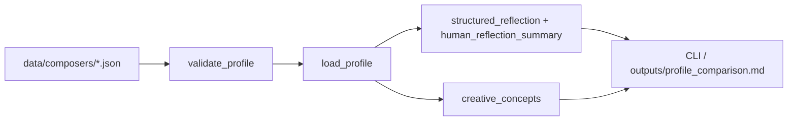

# composer-system

This repository models historically grounded composers as **structured creative identities** stored in JSON and validated against a shared schema. It is a small Python library for loading profiles, deriving structured reflections, and assembling creative-concept scaffolding from that data.

## What this repo is

- Data-first composer profiles with explicit separation of impression, depth, personality, artistic identity, musical style, and creative process  
- Schema-backed validation (Pydantic models with an exportable JSON Schema)  
- Safe loading (path confinement, filename-to-id checks)  
- Deterministic helpers that derive prompts and briefs **only** from profile fields  

## What this repo is not

- Not an agent runtime, tool executor, orchestration layer, or workflow engine  
- Not a control plane and **not** part of Jarvis HUD, OpenClaw, or similar stacks  
- Not a substitute for musicology: interpretive fields should be labeled and kept cautious in `source_notes`  

## Current composers

Shipped example profiles live in `data/composers/`:

- `bach.json`  
- `beethoven.json`  
- `chopin.json`  
- `mozart.json`  

Add new files as `{id}.json` where `id` matches the `id` field inside the JSON.

## Pipeline

Data flows in one direction: validate early, derive text only from loaded profiles, expose via CLI or markdown.



## Example output

### CLI: human reflection summary

From the repo root (with venv activated):

```bash
python -m app.cli show chopin
```

That prints a short, deterministic prose summary built only from the Chopin profile—no LLM. Example (current generator; yours may match after data tweaks):

```text
For Frédéric Chopin, aims like sustain vocal bel canto analogies in piano texture and embed folkloric gesture without reducing works to postcard nationalism are set against a backdrop characterized as Romantic piano culture centered on Paris salons, teaching, and publishing; Polish origin and diasporic identity are recurrent themes in reception and in his own letters and works. Often remembered as the archetypal composer of intimate piano lyricism: mazurkas, polonaises, nocturnes, and études associated with refinement, singing line, and national color, while his artistic world also includes large-scale forms (ballades, scherzos, sonatas), formal experimentation within dance genres, and a documented engagement with pedagogy, orchestration in early works, and the economics of publishing and performance networks. Sonically the profile highlights rubato treated as structural rather than merely ornamental in many works, ornamental variation across repeats and editions, and dance genres as carriers of large-scale drama as well as charm, although stylistic bullets summarize widely taught features, anchoring practice in revision visible across parallel versions and editions and workshop-like refinement in teaching contexts feeding public performance repertory — Process claims lean on edition scholarship and pedagogy traces.
```

### Full comparison artifact

For JSON reflection, human summary, and numbered creative-concept seeds for **all** composers:

```bash
python -m app.cli compare
```

Open `outputs/profile_comparison.md`.

## Setup and tests

```bash
python -m venv .venv
source .venv/bin/activate
pip install -r requirements.txt
pytest
```

## Schema export

The canonical schema is defined in code (`composer_system/models.py`). Export JSON Schema for editors and external validators:

```bash
python -c "from composer_system.validate import profile_json_schema; open('schemas/composer_profile.v1.json','w').write(profile_json_schema())"
```

Re-run this after any model change so `schemas/composer_profile.v1.json` stays in sync.

## Adding a new composer safely

1. Copy an existing file in `data/composers/` and rename it to `{slug}.json`.  
2. Set `id` to the same slug (lowercase, no path segments).  
3. Fill `public_impression` and `deeper_dimensions` without reducing the figure to a single cartoon trait.  
4. Use `source_notes` to separate **well-attested facts** (dates, places, surviving sources) from **interpretive modeling**.  
5. Run `pytest` so `tests/test_profiles.py` catches duplicates, empty `source_notes`, and shallow caricature phrasing.  

## License

Add a license if you plan to publish the repo publicly.
